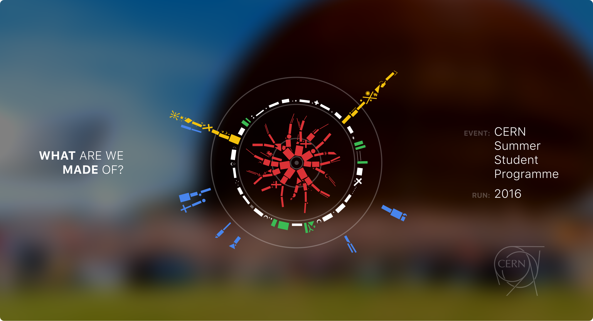
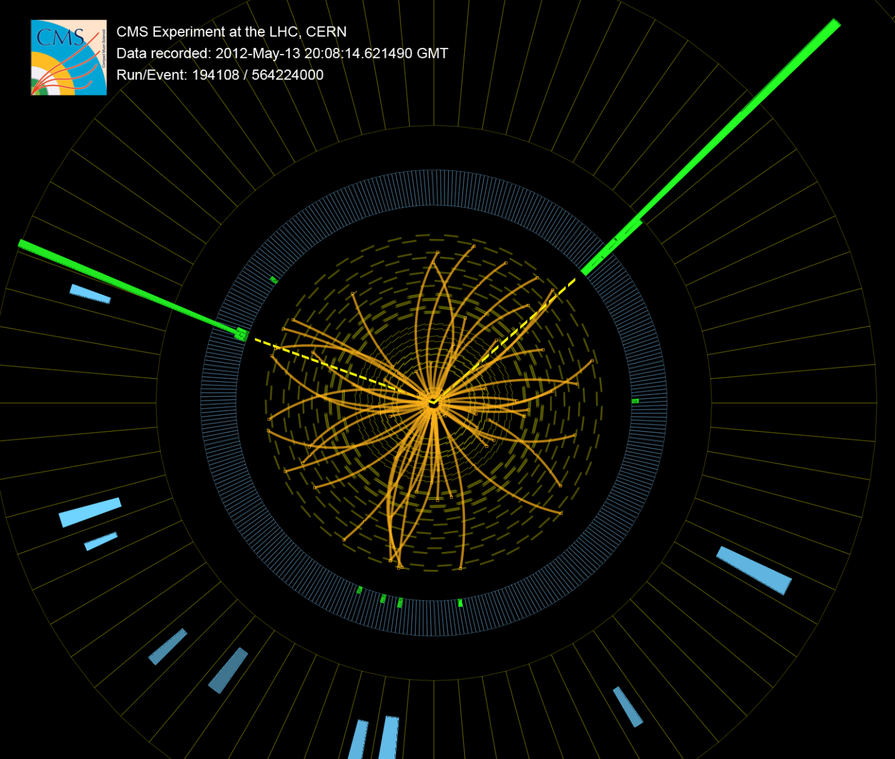
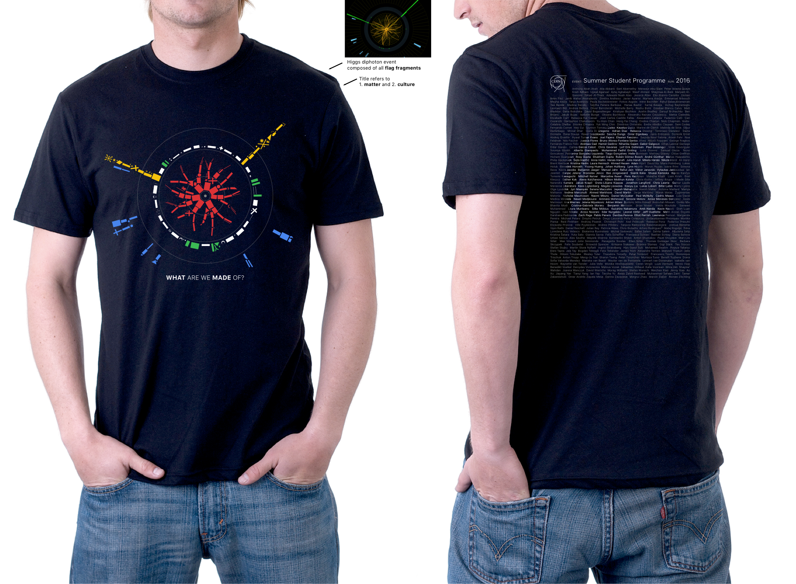
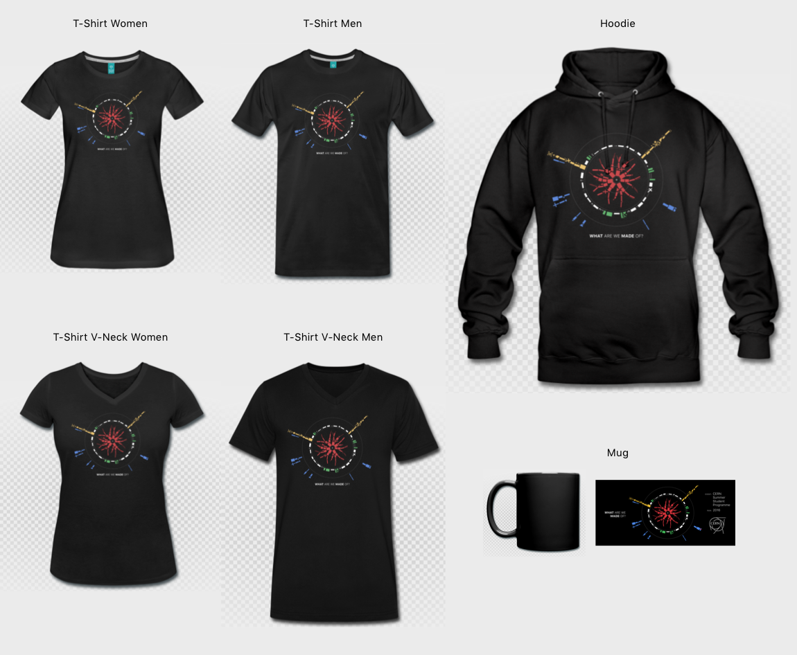

# Flag Fragments

**CERN Summer Student Programme 2016 T-Shirt Design**

- [Download Design Bundle](https://github.com/knly/cern-flag-fragments-shirt/archive/master.zip)
- [Download Wallpaper](https://github.com/knly/cern-flag-fragments-shirt/raw/master/Wallpaper.png)

The design shows an abstract Higgs diphoton event such as this:

Image: [CMS Higgs Search in 2011 and 2012 data: candidate photon-photon event (8 TeV): 3D, r-phi and r-z transverse views](https://cds.cern.ch/record/1606503)

It is composed of fragments of all the participants' national flags and captioned _"What are we made of?"_:

The design tries to capture the extraordinary scientific and intercultural experience of the CERN Summer Student Programme.

## Print Variations

We offered these variations to participants of the CERN Summer Student Programme 2016:

## Credits

- Design: [Nils Fischer](https://github.com/knly) [[n.fischer@viwid.com](mailto:n.fischer@viwid.com)]
- T-Shirt Organization Team: Silke Möbius, Kalle Vuorinen
